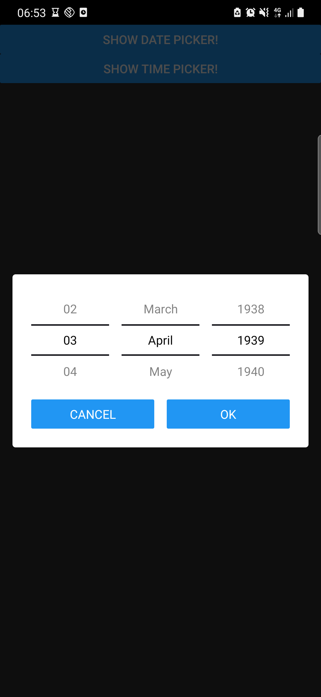
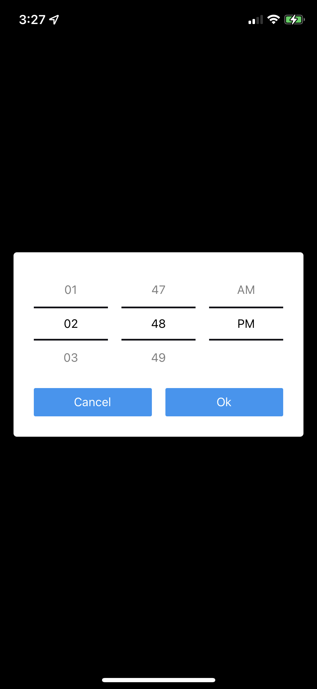
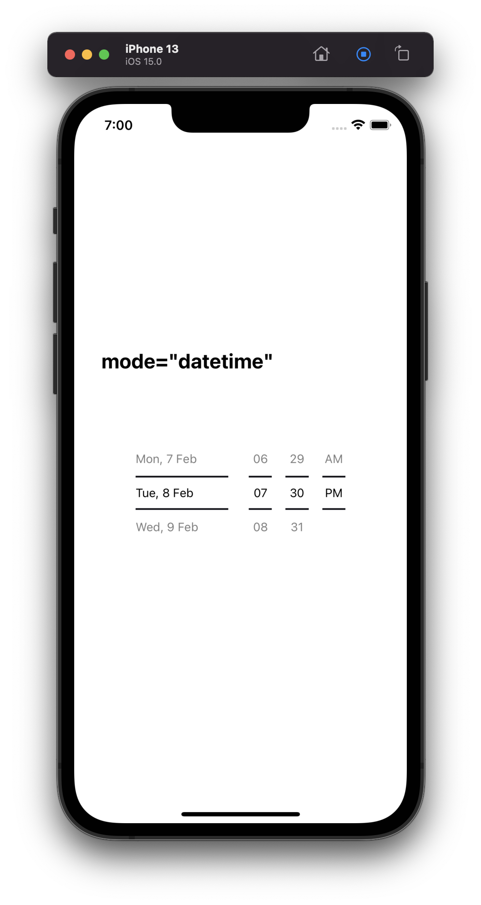
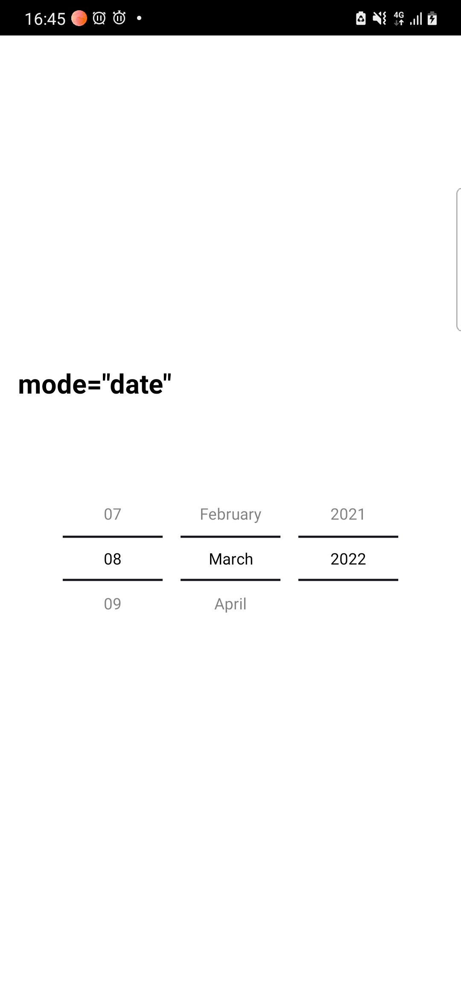
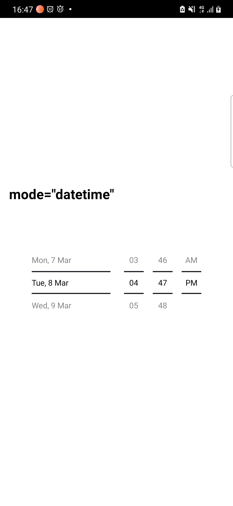

# React Native DateTimePicker

React Native date & time picker component for iOS, Android written without using any Native modules. It's highly customizable and can be easily modified.

## :camera: Screenshots

<table>
  <tr><td colspan=2><strong>iOS</strong></td></tr>
  <tr>
    <td><p align="center"></p></td>
    <td><p align="center"></p></td>
    <td><p align="center"></p></td>
  </tr>
  <tr><td colspan=2><strong>Android</strong></td></tr>
  <tr>
    <td><p align="center"></p></td>
    <td><p align="center"></p></td>
    <td><p align="center"></p></td>
  </tr>
</table>

## 📲 Getting started

```bash
npm install @mohalla-tech/react-native-date-time-picker --save
```

or

```bash
yarn add @mohalla-tech/react-native-date-time-picker
```

> No linking or pod install are required.

## 📝 General Usage

```js
import React, { useState } from 'react';
import { View, Text } from 'react-native';
import DateTimePicker from 'react-native-date-time-picker';

const App = () => {
    const initialDate = new Date(1950, 6, 15, 7, 30);
    const [date, setDate] = useState(initialDate);
    const [time, setTime] = useState(initialDate);
    const [datetime, setDatetime] = useState();

    const onDateChange = (selectedDate: Date) => setDate(selectedDate);

    const onTimeChange = (selectedTime: Date) => setTime(selectedTime);

    const onDatetimeChange = (selectedDatetime: Date) => setDatetime(selectedDatetime);

    return (
        <View>
            <Text style={styles.text}>mode="date"</Text>
            <DateTimePicker mode="date" initialValue={initialDate} onChange={onDateChange} />

            <Text style={styles.text}>mode="time"</Text>
            <DateTimePicker
                mode="time"
                is24Hour={false}
                initialValue={initialDate}
                onChange={onTimeChange}
            />

            <Text style={styles.text}>mode="datetime"</Text>
            <View style={styles.card}>
                <DateTimePicker mode="datetime" onChange={onDatetimeChange} />
            </View>
        </View>
    );
};

export default App;
```

> Note: `mode` change on the fly is not supported

## ⚙️ Props

ListItemStyleType = { color?: string; backgroundColor?: string }
Mode = 'date' | 'time' | 'datetime'

| Prop           | Type              | Required | Default    | Description                                                |
| -------------- | ----------------- | -------- | ---------- | ---------------------------------------------------------- |
| mode           | Mode              | -        | 'date'     | Defines the type of the picker.                            |
| initialValue   | Date              | -        | new Date() | Initial Date to scroll to                                  |
| minimumDate    | Date              | -        | undefined  | Minimum Date available to select(only for "datetime" mode) |
| maximumDate    | Date              | -        | undefined  | Maximum Date available to select(only for "datetime" mode) |
| is24Hour       | boolean           | -        | false      | Display TimePicker in 24 hour.                             |
| minuteInterval | number            | -        | 1          | Interval gap in minute list                                |
| onChange       | function          | ✅       | -          | Callback to be called every time user change date.         |
| itemHeight     | number            | -        | 40         | Height of single item in list                              |
| containerStyle | ViewStyle         | -        | undefined  | Outermost View style                                       |
| listItemStyle  | ListItemStyleType | -        | undefined  | Style for individual list item text                        |
| separatorColor | string            | -        | undefined  | Color for the separator between 2 item                     |
| flatListProps  | FlatListProps     | -        | undefined  | To optimise FlatList add optimizations to this prop        |

## 📣 Acknowledgements

-   [react-native-module-template](https://github.com/demchenkoalex/react-native-module-template)

## 🛡 License

This project is licensed under the MIT License - see the [LICENSE.md](LICENSE.md) file for details.
