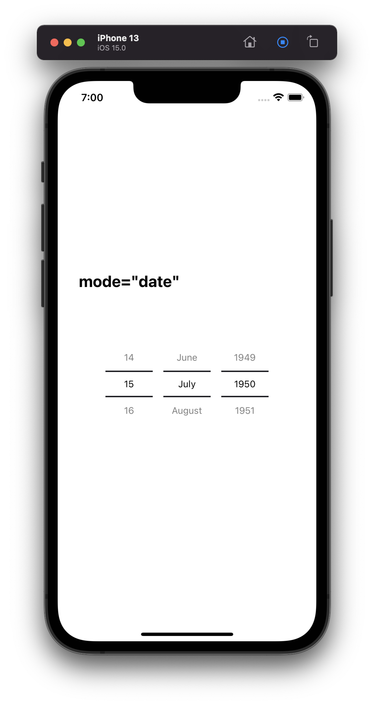
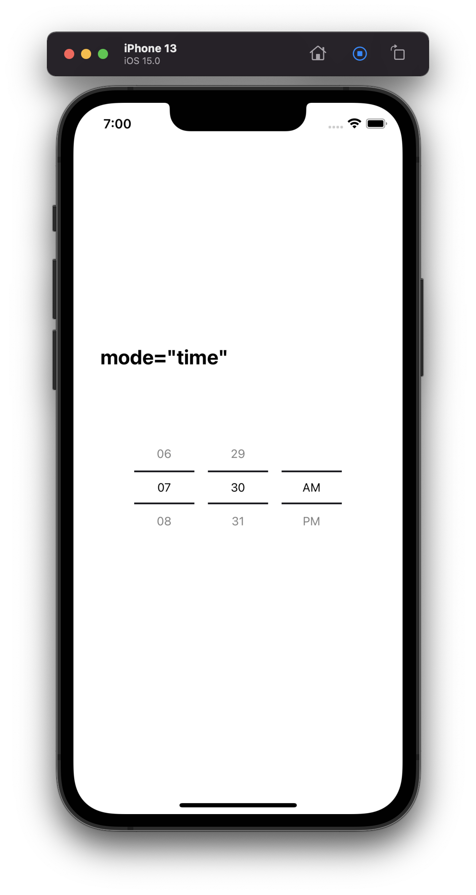
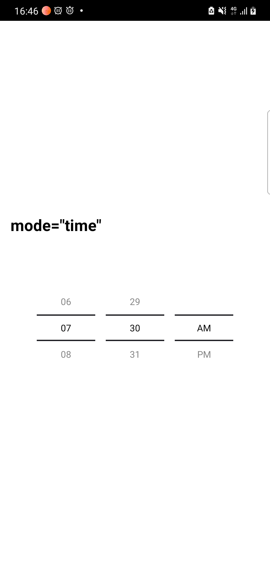

# React Native DateTimePicker

React Native date & time picker component for iOS, Android written without using any Native modules. It's highly customizable and can be easily modified.

## :camera: Screenshots

<table>
  <tr><td colspan=2><strong>iOS</strong></td></tr>
  <tr>
    <td><p align="center"></p></td>
    <td><p align="center"></p></td>
  </tr>
  <tr><td colspan=2><strong>Android</strong></td></tr>
  <tr>
    <td><p align="center"></p></td>
    <td><p align="center"></p></td>
  </tr>
</table>

## 📲 Getting started

```bash
npm install @sharechat/react-native-date-time-picker --save
```

or

```bash
yarn add @sharechat/react-native-date-time-picker
```

> No linking or pod install are required.

## 📝 General Usage

```js
import React, { useState } from 'react';
import { View, Button, Modal } from 'react-native';
import DateTimePicker from 'react-native-date-time-picker';

const App = () => {
    const [date, setDate] = useState(new Date(1598051730000));
    const [mode, setMode] = useState('date');
    const [show, setShow] = useState(false);

    const onConfirm = (selectedDate) => {
        const currentDate = selectedDate || date;
        setShow(false);
        setDate(currentDate);
    };

    const showMode = (currentMode) => {
        setShow(true);
        setMode(currentMode);
    };

    const showDatepicker = () => {
        showMode('date');
    };

    const showTimepicker = () => {
        showMode('time');
    };

    const closeModal = () => {
        setShow(false);
    };

    return (
        <View>
            <Button onPress={showDatepicker} title="Show date picker!" />
            <Button onPress={showTimepicker} title="Show time picker!" />
            <Modal visible={show} onRequestClose={closeModal}>
                <DateTimePicker
                    value={date}
                    mode={mode}
                    is24Hour={true}
                    onConfirm={onConfirm}
                    onClose={closeModal}
                />
            </Modal>
        </View>
    );
};

export default App;
```

## ⚙️ Props

| Prop               | Type             | Default              | Description                                                     |
| ------------------ | ---------------- | -------------------- | --------------------------------------------------------------- |
| mode               | 'date' or 'time' | 'date'               | Defines the type of the picker.                                 |
| value              | Date             | new Date()           | The currently selected date.                                    |
| is24Hour           | boolean          | false                | Display TimePicker in 24 hour.                                  |
| onClose            | function         | undefined            | Callback for when user presses cancel button.                   |
| onConfirm          | function         |                      | Date callback when user presses confirm button.                 |
| itemHeight         | number           | 40                   | Height of single item in list                                   |
| containerStyle     | ViewStyle        | undefined            | Outermost View style                                            |
| listItemStyle      | TextStyle        | undefined            | Style for individual list item text                             |
| confirmButtonStyle | ViewStyle        | undefined            | Style for confirm CTA                                           |
| confirmTextStyle   | TextStyle        | undefined            | Style for confirm CTA text                                      |
| closeButtonStyle   | ViewStyle        | undefined            | Style for close CTA                                             |
| closeTextStyle     | TextStyle        | undefined            | Style for close CTA text                                        |

## 📣 Acknowledgements

-   [react-native-module-template](https://github.com/demchenkoalex/react-native-module-template)

## 🛡 License

This project is licensed under the MIT License - see the [LICENSE.md](LICENSE.md) file for details.
